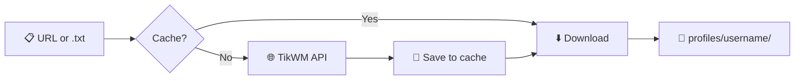

If this helped you, consider starring the repo ⭐

<div align="center">

# 🎬 Ez-TikTok-Downloader

### *Download TikTok videos without watermark — elegant, cached, and folder-per-creator.*

[](https://www.python.org/)
[](./LICENSE)

**🚫 No watermark · 📺 ORIGINAL QUALITY · 💾 Smart link cache · 📁 Neat filenames**


</div>

---

<table>
<tr>
<td width="69%">

### ⚡ Quick start

1. Run **`dependencies.bat`** (once)
2. Run **`run.bat`**
3. Paste a TikTok URL or path to a `.txt` file
4. Done! Check the **`profiles`** folder 🎉


</tr>
</table>

---

## 🎯 What is this?

**Ez-TikTok-Downloader** is a small, no-nonsense tool that:

| Feature | Description |
|--------|--------------|
| 🌐 **ORIGINAL QUALITY** | Uses tikWM api so it downloads original quality videos. |
| ✨ **PRIVATE VIDEOS** | Add your cookie sessionID and you are good to go. |
| 🚫 **No watermark** | Saves the video without the TikTok logo overlay. |
| 📁 **Organized by creator** | Everything goes into folders by username (and story/highlight subfolders when applicable). |
| 📅 **Smart filenames** | `Username - Date(YY-mm-dd) - ProfileUniqueID - idPost` — archivist-friendly and sortable. |
| 💾 **Link cache** | Once a download link is fetched, it’s saved. If the app crashes, you don’t re-fetch 50 links. |
| 📄 **Batch from .txt** | Paste many URLs in a text file and point the script at it. |

You run it, paste a TikTok link (or a path to a `.txt` full of links), and it downloads. That’s it.

### 🔄 How it works (flow)



---

## ✨ What you get

- **Videos** → One folder per **username**, filenames like:  
  `Username - YY-mm-dd - ProfileUniqueID - VideoID.mp4`
- **Stories** → Same username folder, inside a **`story`** subfolder.
- **Highlights** → Same username folder, inside a **`highlight`** subfolder.

All without watermark, with a local cache so re-runs (or crashes) don’t waste time re-extracting links.

---


## 📥 Installation (step by step)

### Step 1 — Get the project 📥

- **Option A:** Download the project as a ZIP from GitHub, then extract it to a folder (e.g. `C:\Users\You\Ez-TikTok-Downloader`).
- **Option B:** If you use Git, clone the repo into that folder.

You should see at least:

| File | What it does |
|------|----------------|
| `tt.py` | Main script |
| `requirements.txt` | Python dependencies |
| `dependencies.bat` | One-time setup (Python + packages) |
| `run.bat` | Launch the downloader |

### Step 2 — Run the installer 🔧

1. Open **File Explorer** and go to the folder where you extracted the project.
2. Double‑click **`dependencies.bat`**.
3. A black window (Command Prompt) will open and:
   - Look for **Python**. If it’s missing, it will try to install it via **winget** (Windows Package Manager).
   - If Python was just installed, it will ask you to **close the window, open a new one**, go back to the same folder, and run **`dependencies.bat`** again.
   - If Python is already there, it will **upgrade pip** and install the required Python packages from `requirements.txt`.
4. When you see something like **“Setup complete”**, you’re done. You can close the window.

> 💡 **If you don’t have Python and winget doesn’t work**  
> The script will tell you to install Python manually from [python.org](https://www.python.org/downloads/). During setup, **check “Add Python to PATH”**, then run **`dependencies.bat`** again from a new Command Prompt.

### Step 3 — You’re ready ✅

- To **run the downloader**, double‑click **`run.bat`** (or open a Command Prompt in that folder and type: `python tt.py`).

```
   🎉 Setup complete!  →  Double‑click run.bat  →  Paste URL  →  Done!
```

---

## 🎮 How to use

### One video

1. Run **`run.bat`** (or `python tt.py`).
2. When it asks: **“Enter a TikTok video URL or path to a .txt file with URLs:”**
3. Paste a link, for example:  
   `https://www.tiktok.com/@creator/video/7123456789012345678`
4. Press **Enter**.  
   The video will be downloaded into the current folder.

### Many videos (batch)

1. Create a **text file** (e.g. `my_links.txt`).
2. Put **one TikTok URL per line**. Save the file.
3. Run **`run.bat`** (or `python tt.py`).
4. When prompted, type the **full path** to your file, e.g.:  
   `C:\Users\You\Desktop\my_links.txt`
5. Press **Enter**.  
   The script will process each link (with a short delay between them to be nice to the server).

### From the command line (optional)

You can skip the prompt and pass the URL or file path directly:

```batch
python tt.py "https://www.tiktok.com/@creator/video/7123456789012345678"
```

```batch
python tt.py "C:\path\to\urls.txt"
```

---

## 🔐 Private videos (session ID)

To download **private** or **friends-only** videos, you can give the script your TikTok **session ID** (a cookie that proves you’re logged in). TikWM uses it to access content your account can see.

### Steps

1. **Log in to TikTok** in your browser (e.g. [tiktok.com](https://www.tiktok.com)).
2. **Open your browser’s developer tools** (often **F12**), then go to **Application** (Chrome) or **Storage** (Firefox) → **Cookies** → `https://www.tiktok.com`.
3. Find the cookie named **`sessionid`** and copy its **Value** (a long string of letters and numbers).
4. In the **same folder as `tt.py`**, create a file named **`sessionid.txt`**.
5. Paste **only the session ID value** into that file (one line, no spaces). Save and close.

   You can paste either:
   - Just the value: `5b1e4c753e7ftest00d85856eb0d67`
   - Or the full form: `sessionid=5b1e4c75test56eb0d67`  
   Both work.

6. Run the script as usual. If it finds `sessionid.txt`, it will print **“Using session ID from sessionid.txt (private videos supported).”** and use that cookie when asking TikWM for links.

To **stop** using your session, delete `sessionid.txt` or clear its contents.

> ⚠️ **Keep your session ID secret.** Don’t share the file or commit it to Git. Anyone with it can act as your account. Add `sessionid.txt` to `.gitignore` if you use version control.

---

## 📂 Where do my files go?

Everything is saved in a **`profiles`** folder inside the directory where you ran the script (usually the same folder as `tt.py`).


```

### Filename format

Each file follows this pattern:

```text
Username - Date(YY-mm-dd) - ProfileUniqueID - idPost
```

| Part | Meaning |
|------|--------|
| **Username** | TikTok @username (handle). |
| **Date (YY-mm-dd)** | Post date when we know it (e.g. `25-03-11` = 2025‑03‑11). |
| **ProfileUniqueID** | TikTok’s internal numeric user ID (or `unknown` if not available). |
| **idPost** | The video/post ID. |

Example:  
`example_creator - 25-06-15 - 6789012345678901234 - 7123456789012345678.mp4`

Slideshows (image posts) get the same base name plus `_img_1`, `_img_2`, etc. (e.g. `.jpg`).

---

## 💾 The magic cache

To get the real download link, the script talks to an external API. That can take a few seconds per video. If you have 50 links and the program crashes at 30, you don’t want to start from zero.

So:

| Step | What happens |
|------|----------------|
| 1️⃣ | **First time** → Script calls TikWM API, gets the link, **saves it to `link_cache.json`**, then downloads. |
| 2️⃣ | **Next time** (or after a crash) → Script checks the cache; if the video is there, it **skips the API** and downloads from the cached link. |
| 3️⃣ | You’ll see **`[Cache] Using cached link for …`** when a cached link is used. |

So: first run = extract + download. After a crash or a new run = cached links are reused, no re-extraction. Links are treated as non-expiring for this purpose.

```
   🔄 Crash at video 30?  →  Run again  →  Videos 1–30 from cache ⚡  →  Only 31–50 call the API
```

---

## 🔧 Troubleshooting

| Problem | What to try |
|--------|--------------|
| **“Python not found”** | Run **`dependencies.bat`** again. If it installed Python, **close the window, open a new Command Prompt**, go back to the project folder, run **`dependencies.bat`** once more. |
| **“No module named 'requests'”** | Open a Command Prompt in the project folder and run: `pip install -r requirements.txt` |
| **“Extraction failed”** | The link might be invalid, private, or the service might be busy. Try again later or with another link. |
| **“File not found” (when using a .txt)** | Type the **full path** to the file (e.g. `C:\Users\You\Desktop\urls.txt`). |
| **Videos not playing** | Make sure you’re not opening the file while it’s still being written. Wait for “Downloaded: …” to appear. |

---

## ❓ FAQ

**Q: Do I need a TikTok account?**  
A: No. Public links are enough.

**Q: Can I download private videos?**  
A: **Yes**, if you add your TikTok session ID to **`sessionid.txt`** (see [Private videos (session ID)](#-private-videos-session-id)). Otherwise only public links work.

**Q: Where is the cache file?**  
A: **`link_cache.json`** in the same folder where you run `tt.py` (usually the project folder). You can delete it to start with a fresh cache.

**Q: Can I change the download folder?**  
A: Run the script from the folder where you want the **`profiles`** folder to appear (e.g. `cd C:\Videos`, then `python path\to\tt.py`). Downloads will go to `profiles/` inside that directory. The cache file (`link_cache.json`) is created in the same directory where you run the script.

**Q: Is this against TikTok’s rules?**  
A: Use it for content you’re allowed to download (e.g. your own, or where you have permission). The authors are not responsible for misuse.

---

## 🙏 Acknowledgements

- **[TikWM](https://www.tikwm.com)** — This project uses TikWM’s API to fetch no-watermark download links. Thanks to them for providing the service.
- Other tools that use the same API (e.g. [Tikorgzo](https://github.com/Scoofszlo/Tikorgzo)) are separate projects; this one is an independent implementation with its own features (link cache, session ID file, profiles folder, custom filenames).

---

<div align="center">


*If you found it useful, a ⭐ on GitHub is always appreciated.*

---

<sub>🎬 Ez-TikTok-Downloader · No watermark · Cache · Session ID · Profiles folder</sub>

</div>


